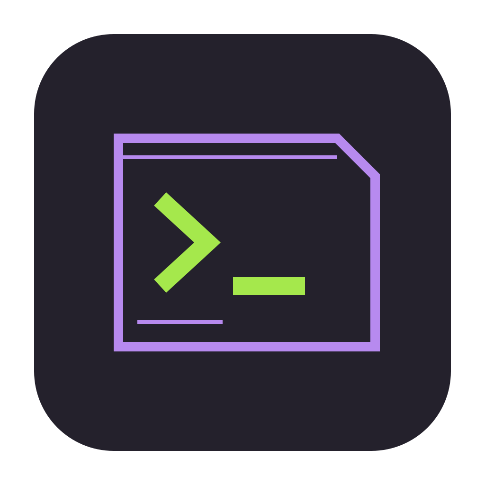

<div align="center">
  
  <h1>Terex UI</h1>
  <p><strong>A native AI terminal and system console.</strong></p>
  <p>
    <a href="https://github.com/3xecutablefile/terex-ui/releases/latest">Downloads</a>
    · <a href="https://github.com/3xecutablefile/terex-ui/issues">Issues</a>
    · <a href="https://github.com/3xecutablefile/terex-ui/actions/workflows/release.yml">Release builds</a>
  </p>
  <p>
    
    
    
  </p>
</div>

Terex UI combines a native Tauri/Rust backend with an eDEX-style desktop layout:
live system and network panels, a three-column file browser, terminal tabs, and
an on-screen keyboard. The default palette is purple and lime; the dashboard
and terminal follow the selected theme together.

## Download

Installers are published to [Releases](https://github.com/3xecutablefile/terex-ui/releases)
after successful pushes to `main`:

| Platform | Downloads |
| --- | --- |
| macOS Apple Silicon | DMG and `.app.tar.gz` |
| macOS Intel | DMG and `.app.tar.gz` |
| Linux x64 | AppImage, DEB, RPM |
| Windows x64 | EXE, MSI |

Each release includes `SHA256SUMS`. Builds are unsigned and macOS builds are not
notarized. Automatic in-app updating is disabled for these unsigned builds.
The packaged desktop app does not require Node.js or pnpm to run.

## Workspace

- **FILES:** native three-column browsing. Single click selects; double click or
  Enter opens a folder, editor, or preview from any column. File controls live
  here, with no duplicate bottom-left explorer. Folder navigation updates an
  idle terminal's directory; terminal `cd` changes update Files. Pending input or
  running commands are preserved; **Sync terminal** retries once the prompt is ready.
- **WORKSPACE:** GPU-rendered Ghostty terminals, persistent tabs, split panes,
  code editing, source control, and web previews.
- **AI AGENT:** chat, project context, attachments, voice, and approval-gated
  tools. Chat and autocomplete pickers show configured custom-endpoint models.
- **TERMINAL HERE:** starts a shell in the browsed directory.
- **ATTACH TO AI:** adds the selected file to the agent composer.
- **CONFIG:** endpoint settings, themes, editor preferences, shortcuts, and agents.

Shells and filesystem operations run through Rust. CPU, memory, process, disk,
and interface counters come from native system APIs. The globe is decorative;
no geolocation service is contacted.

### Background Work

Dashboard samples run every five seconds while visible, with process/disk scans
cached for fifteen seconds. Dashboard timers and the clock stop when the window
is hidden or occluded; filesystem watchers and listings pause when Files is not
visible. Terminal input and output retain their independent responsive path.
Right-click opens app actions, while editable fields keep their standard editing
menus. The interface still uses Tauri's system WebView.

## AI Setup And Existing Data

Open **CONFIG → Models**, add an **OpenAI Compatible** custom endpoint, and enter
its base URL, model ID, and API key if needed. Local endpoints can be keyless.
Existing provider keys remain available for compatible features such as voice.

When an existing Terax profile is found, Terex UI uses its settings, custom
endpoints, chats, agents, snippets, todos, custom themes, and spaces directly.
The existing keychain entries are reused; credentials are not copied into the
repository. The native app identifier is `io.github.3xecutablefile.terex-ui`.

Compatibility identifiers, including the `TERAX.md` project-memory filename,
remain supported so existing profiles and integrations continue to work.

## Development

Install Node.js 24+, pnpm, stable Rust, and the
[Tauri platform prerequisites](https://tauri.app/start/prerequisites/).

```sh
pnpm install --frozen-lockfile
pnpm tauri dev
```

`pnpm dev` alone serves the frontend at `http://127.0.0.1:1420/`. Native terminal,
filesystem, and keychain access require the Tauri desktop host.

```sh
# Production installers for the current operating system
pnpm tauri build

# macOS debug app bundle
pnpm tauri build --debug --bundles app
```

The macOS debug bundle is `src-tauri/target/debug/bundle/macos/Terex UI.app`.

### Checks

```sh
pnpm check-types
pnpm lint
pnpm exec vitest run --maxWorkers=4
cargo test --manifest-path src-tauri/Cargo.toml --locked
cargo clippy --manifest-path src-tauri/Cargo.toml --all-targets --locked -- -D warnings
```

## Automatic Releases

`.github/workflows/release.yml` runs on pushes to `main`, with an optional manual
dispatch. It checks the frontend, builds all four platform targets in parallel,
and publishes one release only after every build succeeds.

No manual tag push is needed. The publishing job creates its own
`build-<run-number>-<attempt>` release tag pointing to the triggering commit.
It uses GitHub's automatic `GITHUB_TOKEN`; signing credentials are not required.

## Credits And License

Terex UI is derived from [Terax](https://github.com/crynta/terax-ai) by Crynta and
retains its native terminal, editor, and AI foundations. Original copyright and
third-party license notices are preserved. Licensed under [Apache-2.0](LICENSE).

[Architecture documentation](docs/README.md) describes the inherited subsystems.
